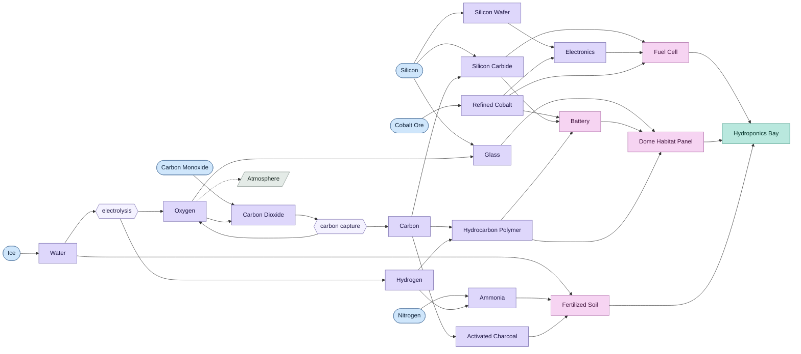

**Warning: This is a work in progress.** It will likely evolve as I develop and
play test the game.

# Production tree

Rounded is a raw material, square an intermediate, pink an assembly. The two
hexagons are the recipes that split, drawn as one step so that both of their
outputs visibly come from it. The dotted edge is the only thing the chain makes
and cannot use.

The diagram is the shape and the tables below are the numbers, which is the one
place this file can drift from itself: an edge here has to be a row there.

## How to read this

Every item below is made by exactly one recipe, and every recipe names its
inputs, its outputs, and the time one run of it takes. Time is ticks,
because a tick is the unit game time is measured in. Sixty-four of them are a
second of real time at normal speed, and nothing here depends on that: running
the world faster runs more ticks rather than longer ones, so these are the same
rates fast-forwarded as at rest.

A recipe may have more than one output. Where a reaction really splits — water
into hydrogen and oxygen, carbon dioxide into carbon and oxygen — one recipe
produces both, and a building that makes the one makes the other whether the
player wants it or not. So a byproduct with nowhere to go is a jam like any
other: a full output port stops the building that filled it, and a line drawing
hydrogen stops when nothing is hauling its oxygen away. What receives what the
player cannot consume is not settled here.

The quantities are a game economy rather than a mass balance: nothing here
conserves atoms, and the chemistry is flavour behind the names rather than a
claim.

Run times rise with tier — 32, 64, 128 and 256 ticks from tier 1 to tier 4 —
doubling for an assembly and doubling again for the final assembly. Within that
ladder the quantities are chosen so that a chain sustaining one Hydroponics Bay
uses a whole number of every building, which is what makes the balance at the
bottom of this file a count rather than an impression.

## Three shapes worth keeping

Each of these was chosen against an obvious alternative, and each is easy to
undo by accident while retuning the numbers.

Oxygen is one item rather than two. Splitting breathable oxygen from the kind a
reaction consumes reads well until the loop is drawn: the same substance twice
cannot close, and one item is what lets the oxygen a carbon plant hands back
feed the plant that spent it.

Glass is silica, so it takes oxygen as well as silicon. Silicon alone is cheaper
to write and makes the silicon branch self-contained, which is exactly the
problem — the oxygen is what ties it to the ice branch and gives the two halves
of the map a reason to meet.

The Hydroponics Bay is powered by a Fuel Cell rather than a solar panel.
Sunlight is a thin thing to plan a base around under an atmosphere thick enough
to need terraforming, and a cell runs on what the tree already makes. What the
tree has no notion of is power itself: a Fuel Cell is a part the Bay is built
from, and once it is standing nothing generates or draws anything.

## Items by tier

|  | Tier 1 | Tier 2 | Tier 3 | Tier 4 |
| --- | --- | --- | --- | --- |
| Raw materials | Ice | Carbon Monoxide, Nitrogen | Silicon | Cobalt Ore |
| Intermediate products | Water, Hydrogen, Oxygen | Carbon Dioxide, Carbon, Ammonia | Silicon Wafer, Glass, Silicon Carbide, Activated Charcoal | Refined Cobalt, Electronics, Hydrocarbon Polymer |
| Assemblies | | | Fertilized Soil | Battery, Fuel Cell, Dome Habitat Panel |

The final assembly, which nothing consumes, is the **Hydroponics Bay**.

## Recipes

### Extraction

A raw material is drawn from a deposit under the building rather than from an
input, so these are the recipes with nothing on their left.

| Inputs | Outputs | Ticks |
| --- | --- | --- |
| — | 1 Ice | 32 |
| — | 1 Carbon Monoxide | 64 |
| — | 1 Nitrogen | 64 |
| — | 1 Silicon | 128 |
| — | 1 Cobalt Ore | 256 |

### Tier 1

| Inputs | Outputs | Ticks |
| --- | --- | --- |
| 1 Ice | 1 Water | 32 |
| 1 Water | 2 Hydrogen + 1 Oxygen | 64 |

### Tier 2

| Inputs | Outputs | Ticks |
| --- | --- | --- |
| 2 Carbon Monoxide + 1 Oxygen | 1 Carbon Dioxide | 64 |
| 1 Carbon Dioxide | 1 Carbon + 1 Oxygen | 64 |
| 1 Nitrogen + 3 Hydrogen | 1 Ammonia | 64 |

### Tier 3

| Inputs | Outputs | Ticks |
| --- | --- | --- |
| 1 Silicon | 1 Silicon Wafer | 128 |
| 1 Silicon + 2 Oxygen | 1 Glass | 128 |
| 1 Silicon + 1 Carbon | 1 Silicon Carbide | 128 |
| 2 Carbon | 1 Activated Charcoal | 128 |
| 4 Water + 4 Ammonia + 2 Activated Charcoal | 1 Fertilized Soil | 256 |

### Tier 4

| Inputs | Outputs | Ticks |
| --- | --- | --- |
| 2 Cobalt Ore | 1 Refined Cobalt | 256 |
| 2 Silicon Wafer + 1 Refined Cobalt | 1 Electronics | 256 |
| 3 Carbon + 6 Hydrogen | 1 Hydrocarbon Polymer | 256 |
| 1 Refined Cobalt + 1 Silicon Carbide + 1 Hydrocarbon Polymer | 1 Battery | 512 |
| 2 Silicon Carbide + 2 Electronics + 2 Refined Cobalt | 1 Fuel Cell | 512 |
| 2 Glass + 1 Battery + 1 Hydrocarbon Polymer | 1 Dome Habitat Panel | 512 |

### Final assembly

| Inputs | Outputs | Ticks |
| --- | --- | --- |
| 2 Fuel Cell + 4 Dome Habitat Panel + 4 Fertilized Soil | 1 Hydroponics Bay | 1024 |

## A balanced chain

One Hydroponics Bay every 1024 ticks, with every building running without
starving and without idling, is forty-seven buildings. Each row's output is
exactly what the rows above it consume, so a row's count is its demand divided
by what one building of it produces — which is why none of them is a fraction.

| Recipe | Buildings | Runs per 1024 ticks |
| --- | --- | --- |
| Ice | 2 | 64 |
| Carbon Monoxide | 6 | 96 |
| Nitrogen | 1 | 16 |
| Silicon | 3 | 24 |
| Cobalt Ore | 6 | 24 |
| Water | 2 | 64 |
| Hydrogen + Oxygen | 3 | 48 |
| Carbon Dioxide | 3 | 48 |
| Carbon + Oxygen | 3 | 48 |
| Ammonia | 1 | 16 |
| Silicon Wafer | 1 | 8 |
| Glass | 1 | 8 |
| Silicon Carbide | 1 | 8 |
| Activated Charcoal | 1 | 8 |
| Refined Cobalt | 3 | 12 |
| Electronics | 1 | 4 |
| Hydrocarbon Polymer | 2 | 8 |
| Fertilized Soil | 1 | 4 |
| Battery | 2 | 4 |
| Fuel Cell | 1 | 2 |
| Dome Habitat Panel | 2 | 4 |
| Hydroponics Bay | 1 | 1 |
| **Total** | **47** | |

Oxygen is a loop rather than a line, and that is the shape worth keeping if
these numbers are ever retuned. Making carbon dioxide spends it and taking the
carbon back out hands it straight back, so the loop pays for itself; what the
electrolysers add on top is surplus. Of the 96 units made per 1024 ticks the
chain consumes 64, and the 32 left over are what the atmosphere objective is
for. Nothing else the chain makes goes unused.

A chain built to any other shape will not come out so even, and that is the
point of the rule rather than a flaw in it. Draw more hydrogen than this and the
oxygen piles up behind it; take the carbon and the oxygen comes back whether
there is anywhere to put it or not.

## Terraforming objectives

What the tree is climbed for. These are goals rather than items: the tree
produces what serves them, and how a planet measures its progress towards one is
not settled here.

- **Build Habitat** — Dome Habitat Panel.
- **Atmosphere (O2 + CO2)** — Oxygen and Carbon Dioxide, released rather than
  assembled into anything. Oxygen is the one thing the chain makes more of than
  it uses, and a chain taking carbon out of the air makes it whether it wants it
  or not, so it has to go somewhere.
- **Temperature** — nothing in the tree serves this one yet.
- **Water** — Water.
- **Plants and food** — Hydroponics Bay.

## Alternatives considered

Parked beside the tree rather than built into it, and kept here so that picking
one up later is a decision rather than a rediscovery: Methane, Ozone, Carbon
Fiber, Fiber Glass, and an Antenna.
